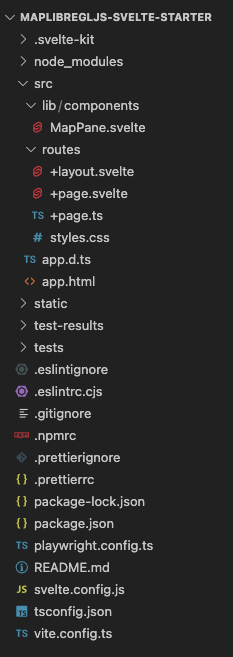

# maplibregljs-svelte-starter


Start MapLibre GL JS and Svelte easily.  
- [MapLibre GL JS v3.3.1](https://maplibre.org)  
- [Svelte v4.0.5](https://svelte.dev)  
- node v20.6.1
- npm v9.8.1

<br>

## blog

[Building a Map Application with MapLibre GL JS and Svelte](https://dev.to/mug-jp/building-a-map-application-with-maplibre-gl-js-and-svelte-pg6)

<br>

## Usage



<br>

Install package
```bash
npm install
```

<br>

code format
```bash
npm run format
```

<br>

build
```bash
npm run build
```

<br>

dev
```bash
npm run dev
```

<br>

Unit Tests
```sh
npm run test:unit
```

<br>

Lint
```sh
npm run lint
```

<br>
<br>


<br>

## License
MIT

Copyright (c) 2023 MapLibre User Group Japan

<br>

---

<br>

### Japanese

<br>

# MapLibre GL JS & Svelte スターター


MapLibre GL JSとSvelteを手軽に始める
- [MapLibre GL JS v3.3.1](https://maplibre.org)  
- [Svelte v4.0.5](https://svelte.dev)  
- node v20.6.1
- npm v9.8.1

<br>

## blog

[MapLibre GL JSとSvelteを組み合わせた開発環境を構築してみた](https://www.memo.dayjournal.dev/memo/try-102)

<br>

##  使用方法


<br>

パッケージインストール

```bash
npm install
```

<br>

コードフォーマット
```bash
npm run format
```

<br>

ビルド

```bash
npm run build
```

<br>

開発

```bash
npm run dev
```

<br>

Unitテスト
```sh
npm run test:unit
```

<br>

リント
```sh
npm run lint
```

<br>
<br>


<br>

## ライセンス
MIT

Copyright (c) 2023 MapLibre User Group Japan

<br>
